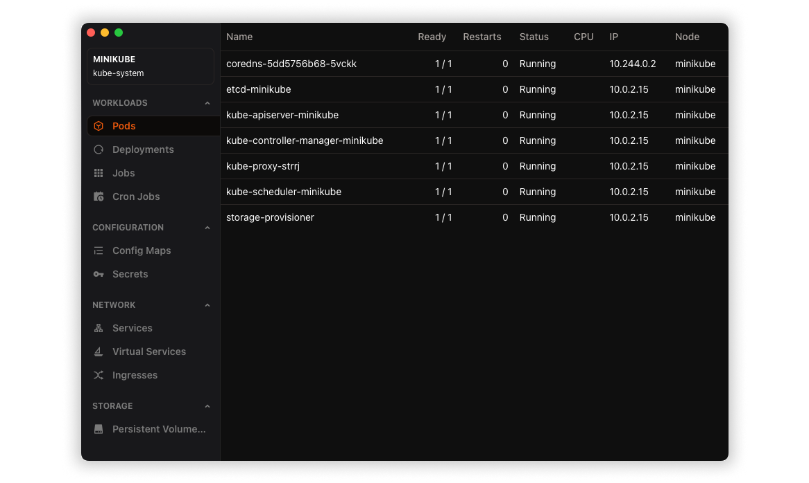

# Tauri + Vue + Vite Template



Simple project template for Tauri and Vue 3.

## Features

- Vue 3 / TypeScript frontend
  - [ESLint](https://eslint.org/) + [Prettier](https://prettier.io/) configured
  - [Vue-devtools](https://devtools.vuejs.org/) installed
  - [Tailwind CSS](https://tailwindcss.com/) w/ PostCSS configured
- Simple and fast [Vite](https://vitejs.dev/) config w/ HMR in development and optimizations for production builds
  - [AutoImport plugin](https://github.com/antfu/unplugin-auto-import)
- [Vitest](https://vitest.dev/) for unit tests
- Github Actions for testing and building
- Debugging configuration set up for VS Code

## Setting Up

1. Install [Tauri Prerequisites](https://tauri.studio/v1/guides/getting-started/prerequisites)
2. Clone and install dependencies (this template uses `pnpm` by default):

```sh
pnpm i
```

## Usage

A Tauri app has at least [two processes](https://tauri.app/v1/guides/architecture/process-model):

- the Core Process (`backend`, or _main_ process in Electron terminology), and
- the WebView process (`frontend`, or _renderer_ in Electron)

### 🦢 Frontend (TS, PnPM)

#### Running Development Server

Both back- and frontend start with a single command:

```sh
pnpm dev
```

#### Testing

```sh
pnpm test
```

### 🦀 Backend (Rust, Cargo)

Backend code lives in `src-tauri/` (Following commands are to be run from there.)

#### Finding Outdated Rust Dependencies

If you have [cargo-outdated](https://github.com/kbknapp/cargo-outdated) installed:

```sh
cargo outdated
```

#### Upgrading Rust Dependencies

If you have [cargo-edit](https://github.com/killercup/cargo-edit) installed:

```sh
cargo upgrade
```

### Debugging

- The `dev` command has by default `RUST_BACKTRACE=1` set which makes Rust output full backtraces to the console. (Remove it from the `package.json` command if you don't want it).
- If you use VS Code, you can debug Rust code with the included `Debug Tauri` config.

### Building and releasing

#### Building

The project has GitHub Actions set up which will automatically test and build your app with every push and PR. For building manually:

```sh
pnpm build
```

#### Releasing a new version

1. Bump version number (In `package.json`, and `src-tauri/tauri.conf.json`)
2. Run `pnpm check` to update `Cargo.lock`
3. Tag the commit you want to release with `vX.Y.Z`
4. Edit the release notes and push (also tags!)
5. Github workflow will automatically build a new draft release for this version. Publish when ready 🎉

## Howto

### Custom title bar styles (like `titleBarStyle: 'hidden'` in Electron)

Tauri doesn't currently offer a method to hide the title bar without hiding all window chrome. There is, however, a fairly simple way to do it manually (with certain limitations; see [Tauri issue #2663](https://github.com/tauri-apps/tauri/issues/2663) for details).

1. Add `cocoa` and `objc` crates to dependencies
2. Add `set_transparent_titlebar` and `position_traffic_lights` from this gist: https://gist.github.com/Uninen/5377381eb81bdcd71b9d1859e46e3e29
3. Call `set_transparent_titlebar` and `position_traffic_lights` from `setup` and `on_window_event` (example in the gist starting line 114) on any window you want affected.

This implementation works but results in visible jerkyness of the traffic lights (on macOS) when the window is resized. (Alternatives discussed in detail in the issue #2663)

## Elsewhere

- [Follow @uninen](https://twitter.com/uninen) on Twitter
- Read my continuously updating learnings around Tauri / Vue / TypeScript and other Web development topics from my [Today I Learned site](https://til.unessa.net/)

## Contributing

Contributions are welcome! Please follow the [code of conduct](./CODE_OF_CONDUCT.md) when interacting with others.
