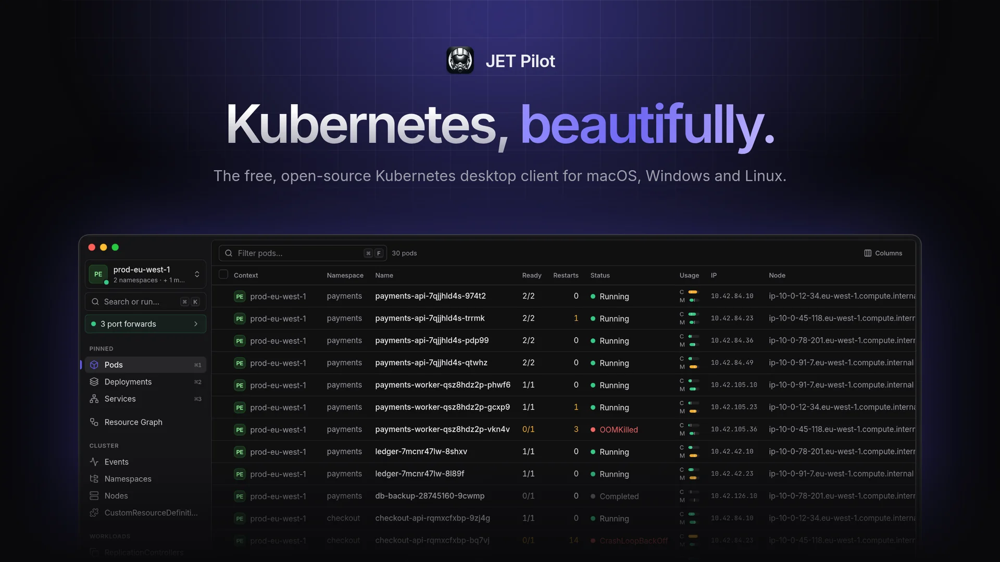

# JET Pilot

<p align="center">
  <picture>
    <source media="(prefers-color-scheme: dark)" srcset="public/header-dark.webp">
    <source media="(prefers-color-scheme: light)" srcset="public/header-light.webp">
    
  </picture>
</p>

<p align="center">
  <b>The open-source Kubernetes IDE that focuses on less clutter, speed and good looks.</b><br/>
  Free · MIT licensed · macOS, Windows &amp; Linux (x64 and ARM64) · <a href="https://www.jet-pilot.app">jet-pilot.app</a>
</p>

## Introduction
JET Pilot is an open-source K8s IDE. It was created out of frustration, as all "good-looking" K8s IDEs went commercial. Power-users nowadays resort to tools like `k9s`, which works great, but heavily relies on keyboard input. JET Pilot combines a keyboard-first workflow with a polished, mouse-friendly desktop UI — built with Rust and Tauri, so it stays small and fast.

No account, no telemetry: JET Pilot uses your existing kubeconfig files and `kubectl`.

## Features
- **Multi-cluster & multi-namespace**: connect to several contexts (across multiple kubeconfig files) and namespaces at once; every table aggregates them with Context and Namespace columns.
- **Built-in terminal**: open a local terminal (<kbd>Ctrl</kbd>+<kbd>`</kbd>) with `kubectl` preconfigured for the current context — your own kubeconfig is never modified. Shell into any container with one click, on macOS, Linux and Windows.
- **Resource graph**: see how Services, Deployments, ReplicaSets, Pods, ConfigMaps and Secrets relate, with live health indicators.
- **Structured log viewer**: follow logs, parse JSON log lines into fields and filter them with facets.
- **Object management**: browse, describe, create and edit any Kubernetes object in a full YAML editor (<kbd>Cmd</kbd>/<kbd>Ctrl</kbd>+<kbd>S</kbd> to apply).
- **Command palette**: <kbd>Cmd</kbd>/<kbd>Ctrl</kbd>+<kbd>K</kbd> to jump anywhere, switch contexts and namespaces or open a terminal — with fuzzy search.
- **Port forwarding**, **Helm** releases and charts, **pod metrics**, events, scaling, rollouts, cordon/drain and more.
- **SSO-friendly**: in-app re-login for exec-plugin based auth such as kubelogin/OIDC and AWS SSO.
- **A premium, accessible UI** with polished dark and light themes.

## Installation

Download the latest release for your platform from the [releases page](https://github.com/unxsist/jet-pilot/releases/latest/) or from [jet-pilot.app](https://www.jet-pilot.app). JET Pilot updates itself automatically.

JET Pilot requires [`kubectl`](https://kubernetes.io/docs/tasks/tools/) on your `PATH` (and `helm` for the Helm views).

### macOS

Install with Homebrew:

```bash
brew install --cask jet-pilot
```

…or download the `.dmg` for Apple Silicon (`aarch64`) or Intel (`x64`), open it and drag JET Pilot into your Applications folder.

> [!IMPORTANT]
> **JET Pilot is not notarized by Apple.** It's free and open source, and we'd rather not pay Apple's yearly developer fee. macOS will therefore say the app *"is damaged and can't be opened"* or *"cannot be verified"*. Remove the quarantine flag once after installing (also after a Homebrew install):
>
> ```bash
> xattr -dr com.apple.quarantine "/Applications/JET Pilot.app"
> ```
>
> That's it — automatic updates keep working afterwards.

### Linux

Packages are available for x64 (`amd64` / `x86_64`) and ARM64 (`aarch64`):

- **Debian / Ubuntu**: `sudo apt install ./JET.Pilot_<version>_<arch>.deb`
- **Fedora / RHEL / openSUSE**: `sudo rpm -i JET.Pilot-<version>-1.<arch>.rpm`
- **AppImage** (any distribution): `chmod +x JET.Pilot_<version>_<arch>.AppImage` and run it.

### Windows

Download the `.exe` (or `.msi`) installer and run it. The installer isn't code-signed, so Windows SmartScreen may warn you — click **More info → Run anyway**.

## Contributing

Issues and pull requests are very welcome! JET Pilot is built with [Tauri v2](https://tauri.app) (Rust) and [Vue 3](https://vuejs.org).

```bash
npm ci
npm run dev             # run the app
npx vitest run          # unit tests
npm run harness         # UI in the browser with mocked cluster data (no cluster needed)
```

Commits follow [Conventional Commits](https://www.conventionalcommits.org); releases are created with semantic-release.

## License

[MIT](LICENSE)
